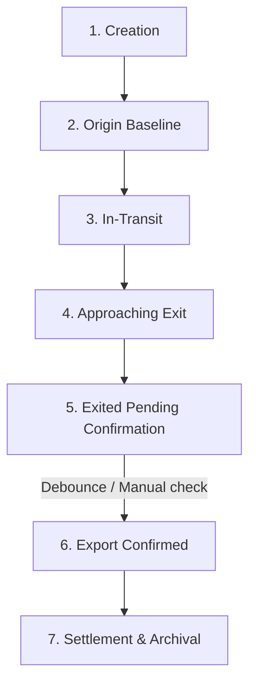

# Export Tracking Process & Geofencing Guide

This document describes the export shipment tracking mechanics, geofencing configurations, and ops exceptions procedures utilized in the ExportTrack Cargo Portal.

---

## 1. Real-World Tracking Flow

An export shipment follows a highly structured lifecycle to ensure cargo integrity, prevent customs evasion, and satisfy compliance reporting:



1.  **Creation**: A shipment export is registered in the system. The product cargo details (weight, container number, categories) are declared.
2.  **Origin Baseline**: The tracker device is mounted. The system checks the initial GPS position coordinates to establish a baseline location origin (e.g. factory coordinates or warehouse polygon).
3.  **In-Transit**: Position updates stream in. The shipment is monitored continuously across standard channels.
4.  **Approaching Exit**: The GPS coords enter the buffer radius of an exit geofence (e.g. port zone, airport gate, or border exit buffer). The shipper is notified that the shipment is nearing the exit.
5.  **Exited Pending Confirmation**: The tracker coordinates cross the exit border polygon boundary. Internal ops/admin teams receive alerts that an exit has been initiated.
6.  **Export Confirmed**: The exit is verified (after receiving 3 consecutive coordinates outside the country border, or manual admin override). Realtime billing/monitoring triggers are turned off, and customs compliance certificates are locked.
7.  **Settlement**: Billing metrics are finalized and the tracker is deactivated, ready to be reassigned.

---

## 2. Status State Machine

The shipment status transitions are restricted by the state machine to prevent illegal jumps and coordinate synchronization errors:

| Current Status | Target Status | Trigger Conditions |
| :--- | :--- | :--- |
| `baseline` | `in_transit` | Received initial position updates matching declaring source origin location. |
| `in_transit` | `approaching_exit` | GPS coordinate falls within a port buffer or checkpoint buffer geofence zone. |
| `approaching_exit` | `in_transit` | Coords move back into central territory, leaving buffer limits. |
| `approaching_exit` | `exited_pending` | Coords cross the outer polygon of the `country_border`. |
| `exited_pending` | `export_confirmed` | Received 3 consecutive pings outside the country border polygon, or manual Admin confirmation. |
| `exited_pending` | `in_transit` | Coords re-enter the country border (alert triggered for false exit or customs turn-back). |
| `*` (Any state) | `exception` | No GPS signals for >24 hours, past scheduled export date, or manual hold. |

---

## 3. Geofence Types & Polygon Authoring

### Geofence Classifications
*   **`country_border`**: A large polygon representing the terrestrial boundary of the country. Crossing this polygon shifts status to `exited_pending`.
*   **`port_zone` / `airport_zone`**: Detailed polygons marking ports of exit.
*   **`checkpoint_buffer`**: Circular or polygonal buffers around exits. Entering this shifts status to `approaching_exit`.

### GeoJSON Authoring
Geofences must be specified in RFC 7946 GeoJSON format. Polygons must close (first and last coordinate in the ring must be identical) and adhere to counter-clockwise orientation:

```json
{
  "type": "Polygon",
  "coordinates": [
    [
      [-122.5, 37.7],
      [-122.4, 37.7],
      [-122.4, 37.8],
      [-122.5, 37.8],
      [-122.5, 37.7]
    ]
  ]
}
```

*Note: Coordinates are ordered as `[longitude, latitude]` according to the GeoJSON spec.*

---

## 4. Debounce Rule Tuning

To prevent false exit triggers due to GPS drift near boundaries, the system uses a debounce rule:
*   A shipment's status shifts to `exited_pending_confirmation` immediately when crossing the border.
*   To transition automatically to `export_confirmed`, the tracker must transmit **3 consecutive positions** located completely outside the border polygon.
*   The debounce count can be tuned in the database settings table under the key `export_exit_debounce_pings`. 
    *   *Lower values (e.g. 1-2)* speed up auto-confirmation but increase susceptibility to noise.
    *   *Higher values (e.g. 5-10)* increase reliability but delay deactivation.

---

## 5. Exception & Overrides Handling

### Signal Loss (GPS Blackout)
*   **Trigger**: No GPS ping is received from an active tracker for more than 24 hours (configurable).
*   **Ops Action**: Flagged automatically as `exception: signal_loss`. Ops must contact the carrier to check for cargo tampering, battery drain, or signal jamming.

### Overdue Shipments
*   **Trigger**: Shipment remains in-transit or approaching exit past its target export date.
*   **Ops Action**: Flagged as `exception: overdue`. Ops must audit the shipment route and adjust schedules if delayed at custom houses.

### Re-entry Alerts
*   **Trigger**: Coords re-enter the country after the shipment has already transitioned to `exited_pending`.
*   **Ops Action**: Immediately triggers a high-priority alert. This suggests possible smuggling, custom rejection, or logistics failure. The cargo must be inspected.

### Manual Override Confirmation
Admins can manually override the debounce check via the `POST /api/shipment-exports/[id]/confirm` API. This is used when:
1.  The tracker battery dies right at the gate.
2.  Customs issues a manual exit certification before the debounce pings compile.

---

## 6. Compliance & Cargo Auditing

Every shipment export captures cargo parameters for custom auditing:
*   `productCategory`: Grouped classification (e.g., `electronics`, `chemicals`, `machinery`).
*   `productDescription`: Plain text list declaring cargo (e.g., "500 silicon wafers").
*   `containerNumber`: Standard shipping ISO container marking (e.g. `MSCU1234567`).
*   `weight` and `quantity` declarations.

Once status becomes `export_confirmed`, all cargo variables are locked against modifications to generate immutable audit trails for tax exemption verification.
